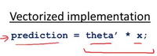

# 多变量线性回归(Linear Regression with Multiple Variables)
### 多维特征
增添更多特征后，我们引入一系列新的注释：  

$n$ 代表特征的数量
${x^{\left( i \right)}}$代表第 $i$ 个训练实例，是特征矩阵中的第$i$行，是一个向量（vector）。  
支持多变量的假设 $h$ 表示为：$h_{\theta}\left( x \right)={\theta_{0}}+{\theta_{1}}{x_{1}}+{\theta_{2}}{x_{2}}+...+{\theta_{n}}{x_{n}}$，  
这个公式中有$n+1$个参数和$n$个变量，为了使得公式能够简化一些，引入$x_{0}=1$，则公式转化为：$h_{\theta} \left( x \right)={\theta_{0}}{x_{0}}+{\theta_{1}}{x_{1}}+{\theta_{2}}{x_{2}}+...+{\theta_{n}}{x_{n}}$  
此时模型中的参数是一个$n+1$维的向量，任何一个训练实例也都是$n+1$维的向量，特征矩阵$X$的维度是 $m*(n+1)$。 因此公式可以简化为：$h_{\theta} \left( x \right)={\theta^{T}}X$，其中上标$T$代表矩阵转置。  

### 多变量梯度下降
多变量线性回归的批量梯度下降算法为：  


### 特征缩放
在我们面对多维特征问题的时候，我们要保证这些特征都具有相近的尺度，这将帮助梯度下降算法更快地收敛。  
最简单的方法是令：${{x}{n}}=\frac{{{x}{n}}-{{\mu}{n}}}{{{s}{n}}}$，其中 ${\mu_{n}}$是平均值，${s_{n}}$是标准差。

### 学习率
梯度下降算法的每次迭代受到学习率的影响，如果学习率$a$过小，则达到收敛所需的迭代次数会非常高；如果学习率$a$过大，每次迭代可能不会减小代价函数，可能会越过局部最小值导致无法收敛。

通常可以考虑尝试些学习率：  

$\alpha=0.01，0.03，0.1，0.3，1，3，10$

### 多项式回归
线性回归并不适用于所有数据，有时我们需要曲线来适应我们的数据，比如一个二次方模型：$h_{\theta}\left( x \right)={\theta_{0}}+{\theta_{1}}{x_{1}}+{\theta_{2}}{x_{2}^2}$ 或者三次方模型： $h_{\theta}\left( x \right)={\theta_{0}}+{\theta_{1}}{x_{1}}+{\theta_{2}}{x_{2}^2}+{\theta_{3}}{x_{3}^3}$  
通常我们需要先观察数据然后再决定准备尝试怎样的模型。 另外，我们可以令：  

${{x}{2}}=x{2}^{2},{{x}{3}}=x{3}^{3}$，从而将模型转化为线性回归模型。

根据函数图形特性，我们还可以使：  

${{{h}}{\theta}}(x)={{\theta }{0}}\text{+}{{\theta }{1}}(size)+{{\theta}{2}}{{(size)}^{2}}$

或者:

${{{h}}{\theta}}(x)={{\theta }{0}}\text{+}{{\theta }{1}}(size)+{{\theta }{2}}\sqrt{size}$

注：如果我们采用多项式回归模型，在运行梯度下降算法前，特征缩放非常有必要。

### 向量化
合理使用向量化会使代码更简洁。  




### python实现
##### 前提
 - 线性：自变量与因变量的关系是线性的。
 - 多元正态分布：误差项应呈正态分布。否则置信区间不稳定。
 - 同方差性：误差项的方差应为常数。在有异常值得数据集上，误差项常常是方差不恒定的。
 - 自变量之间相互独立：若不相互独立，则模型会具有多重共线性。
 
 
##### 虚拟变量
 在多元回归模型中当遇到数据集是非数值数据类型时，为其分配虚拟变量。
##### 虚拟变量陷阱
虚拟变量陷阱是指两个以上的变量之间高度相关，即存在一个能够被其他变量预测出的变量。
 解决虚拟变量陷阱的方法时，类别变量个数减去1。

##### Step 1 数据预处理
有必要时，编辑虚拟变量，避免虚拟变量陷阱。
```
import numpy as np
import pandas as pd
from sklearn.preprocessing import Imputer, LabelEncoder, OneHotEncoder,StandardScaler
from sklearn.model_selection import train_test_split

dataset = pd.read_csv(r'C:\Users\96251\Desktop\ML_code\files\100-Days-Of-ML-Code-master\datasets\50_Startups.csv')
X = dataset.iloc[ : , :-1].values
Y = dataset.iloc[ : , 4].values

labelencoder_X = LabelEncoder()
X[ : , 3] = labelencoder_X.fit_transform(X[ : , 3])
onehotencoder = OneHotEncoder(categorical_features= [3])
X = onehotencoder.fit_transform(X).toarray()

X = X[: , 1: ]  #避免虚拟虚拟变量陷阱

X_train, X_test, Y_train, Y_test = train_test_split(X, Y, test_size=0.2, random_state=0)
```

##### Step 2 训练多元线性回归模型与预测

```
from sklearn.linear_model import LinearRegression
regressor = LinearRegression()
regressor.fit(X_train, Y_train)
y_pred = regressor.predict(X_test)
```
##### Step 3 对多元数据进行可视化
这里我们使用seaborn进行可视化。
seaborn的pairplot函数绘制X的每一维度和对应Y的散点图。

```
import seaborn as sns
sns.pairplot(dataset,x_vars=["Administration", "R&D Spend", "Marketing_Spend"], y_vars="Profit", hue="State", kind='reg')
plt.show()
```

