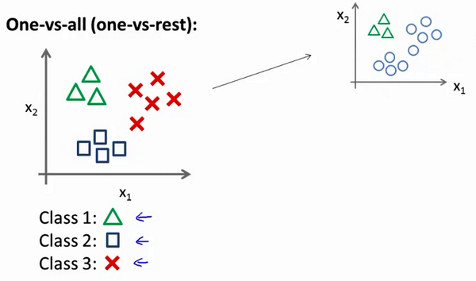

# 逻辑回归

### 分类问题
在分类问题中，你要预测的变量 $y$ 是离散的值，我们将利用逻辑回归 (Logistic Regression) 算法。

### 假说表示
 逻辑回归模型的假设是： $h_\theta \left( x \right)=g\left(\theta^{T}X \right)$   
 其中： $X$ 代表特征向量 $g$ 代表逻辑函数（logistic function)是一个常用的逻辑函数为S形函数（Sigmoid function），公式为：  
 $g\left( z \right)=\frac{1}{1+{{e}^{-z}}}$。
 
 ### 判定边界
在逻辑回归中，我们预测：  
当${h_\theta}\left( x \right)>=0.5$时，预测 $y=1$。  
当${h_\theta}\left( x \right)<0.5$时，预测 $y=0$ 。  

  
现在假设我们有一个模型：  
  
并且参数$\theta$ 是向量[-3 1 1]。 则当$-3+{x_1}+{x_2} \geq 0$，即${x_1}+{x_2} \geq 3$时，模型将预测 $y=1$。 我们可以绘制直线${x_1}+{x_2} = 3$，,将预测为1的区域和预测为 0的区域分隔开。  
假使我们的数据呈现这样的分布情况，怎样的模型才能适合呢？  
  

因为需要用曲线才能分隔 $y=0$ 的区域和 $y=1$ 的区域，我们需要二次方特征：${h_\theta}\left( x \right)=g\left( {\theta_0}+{\theta_1}{x_1}+{\theta_{2}}{x_{2}}+{\theta_{3}}x_{1}^{2}+{\theta_{4}}x_{2}^{2} \right)$是[-1 0 0 1 1]，则我们得到的判定边界恰好是圆点在原点且半径为1的圆形。

我们可以用非常复杂的模型来适应非常复杂形状的判定边界。  

### 代价函数
对于线性回归模型，我们定义的代价函数是所有模型误差的平方和。理论上来说，我们也可以对逻辑回归模型沿用这个定义，但是问题在于，当我们将${h_\theta}\left( x \right)=\frac{1}{1+{e^{-\theta^{T}x}}}$带入到这样定义了的代价函数中时，我们得到的代价函数将是一个非凸函数（non-convexfunction）。  
  
这意味着我们的代价函数有许多局部最小值，这将影响梯度下降算法寻找全局最小值。  
线性回归的代价函数为：$J\left( \theta \right)=\frac{1}{m}\sum\limits_{i=1}^{m}{\frac{1}{2}{{\left( {h_\theta}\left({x}^{\left( i \right)} \right)-{y}^{\left( i \right)} \right)}^{2}}}$ 。 我们重新定义逻辑回归的代价函数为：$J\left( \theta \right)=\frac{1}{m}\sum\limits_{i=1}^{m}{{Cost}\left( {h_\theta}\left( {x}^{\left( i \right)} \right),{y}^{\left( i \right)} \right)}$，其中  
    
在得到这样一个代价函数以后，我们便可以用梯度下降算法来求得能使代价函数最小的参数了。算法为：

Repeat { $\theta_j := \theta_j - \alpha \frac{\partial}{\partial\theta_j} J(\theta)$ (simultaneously update all ) }

求导后得到：

Repeat { $\theta_j := \theta_j - \alpha \frac{1}{m}\sum\limits_{i=1}^{m}{{\left( {h_\theta}\left( \mathop{x}^{\left( i \right)} \right)-\mathop{y}^{\left( i \right)} \right)}}\mathop{x}_{j}^{(i)}$ (simultaneously update all ) }  

一些梯度下降算法之外的选择： 除了梯度下降算法以外，还有一些常被用来令代价函数最小的算法，这些算法更加复杂和优越，而且通常不需要人工选择学习率，通常比梯度下降算法要更加快速。这些算法有：共轭梯度（Conjugate Gradient），局部优化法(Broyden fletcher goldfarb shann,BFGS)和有限内存局部优化法(LBFGS)。  

### 多类别分类
对于一个多类分类问题，我们的数据集或许看起来像这样：  

    
我们下面要做的就是使用一个训练集，将其分成3个二元分类问题。
我们先从用三角形代表的类别1开始，实际上我们可以创建一个，新的"伪"训练集，类型2和类型3定为负类，类型1设定为正类，我们创建一个新的训练集，如下图所示的那样，我们要拟合出一个合适的分类器。  

    
为了能实现这样的转变，我们将多个类中的一个类标记为正向类（$y=1$），然后将其他所有类都标记为负向类，这个模型记作$h_\theta^{\left( 1 \right)}\left( x \right)$。接着，类似地第我们选择另一个类标记为正向类（$y=2$），再将其它类都标记为负向类，将这个模型记作 $h_\theta^{\left( 2 \right)}\left( x \right)$,依此类推。 最后我们得到一系列的模型简记为： $h_\theta^{\left( i \right)}\left( x \right)=p\left( y=i|x;\theta \right)$其中：$i=\left( 1,2,3....k \right)$

最后，在我们需要做预测时，我们将所有的分类机都运行一遍，然后对每一个输入变量，选择一个让 $h_\theta^{\left( i \right)}\left( x \right)$ 最大的$ i$，即$\mathop{\max}\limits_i,h_\theta^{\left( i \right)}\left( x \right)$。
